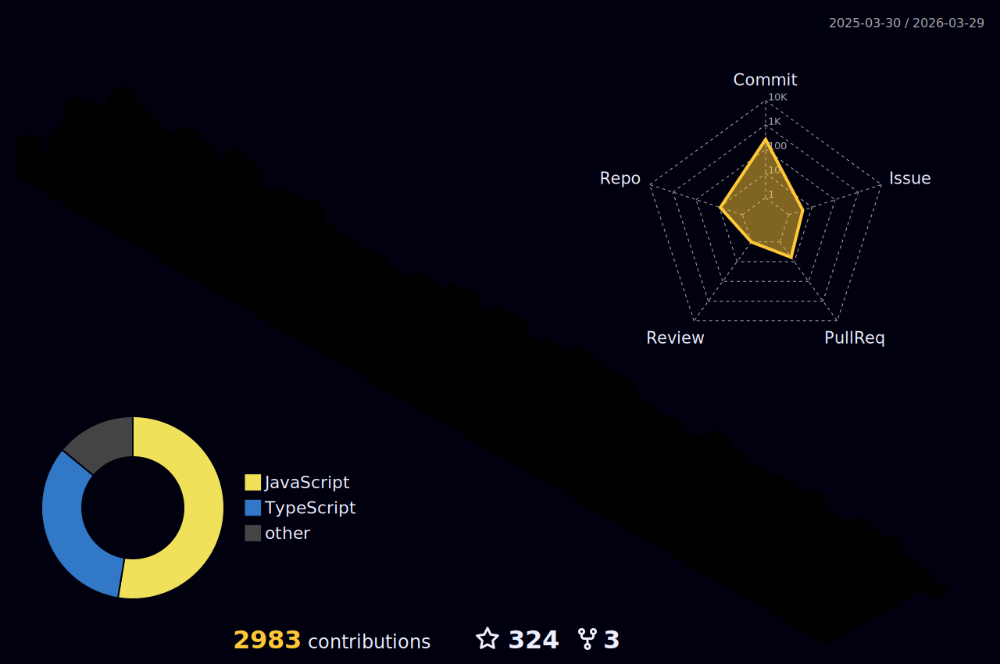

<h1 align="center">Hi 👋, I'm Himanshu</h1>

  

- 🔭 Checkout My Project [Dr.Appointment Booking Web App](https://drbookwebapp-frontend.onrender.com/)
- 🔭 Checkout My Project [Synk Chat Application](https://synk-chat-five.vercel.app/)
- 🔭 Checkout My Portfolio [Himanshu Mishra](https://hemanshu-mishra.vercel.app/)
- 🤝 I’m looking for help with [React, Next JS , Node JS]
- 🌱 I’m currently learning **TypeScript**
- 💬 Ask me about **React JS,Node JS , TypeScript**

 
 

 

<h3 align="left">Connect with me:</h3>

###
<h2 align="left">💪Statistics:</h2>

                       

 
 

## 🏆 GitHub Trophies

### ✍️ Random Dev Quote

###

### 🔮 My 3D Contribution Grid

<a href="https://github.com/himanshu12866">

<h2 align="left">⚡Activity Graph:</h2>

